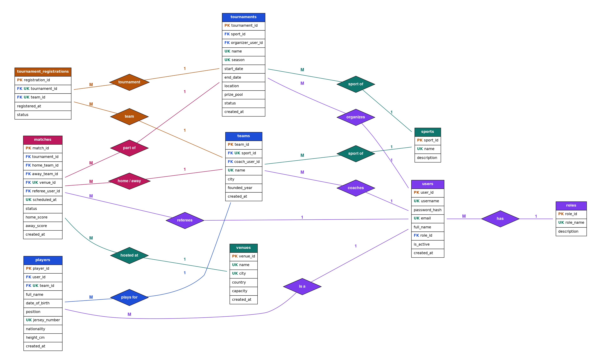

# 🏆 Sports Tournament Management System

A full-stack database course project featuring a **relational schema (9 tables)**, a
**Flask web GUI (7 screens)**, **7 analytical SQL queries**, and **6 PL/pgSQL blocks**
(3 functions, 1 procedure, 2 triggers). Works locally with zero setup (SQLite) and
is ready to deploy to **Supabase / Render / Railway** with PostgreSQL.

---

## 1. Project members

| Student Nº | Name                     |
|-----------:|--------------------------|
| 22205409   | MOHAMED ABURAGIBA        |
| 22302754   | Mohammed Nouri           |
| 22205300   | Gasem Qahtan             |
| 22208946   | Maher Ba Akabah          |
| 22203107   | MHD Yaman Almallasalem   |
| 22204143   | Emad Ghilan              |
---

## 2. Domain & assumptions

The system models a multi-sport tournament platform and supports five user groups:

| Role          | Capabilities (enforced at route level)                             |
|---------------|--------------------------------------------------------------------|
| **admin**     | Full CRUD on every table; delete tournaments / venues              |
| **organizer** | Create tournaments, register teams, schedule matches, assign refs  |
| **coach**     | Manage his/her team's roster (players)                             |
| **referee**   | Officiate assigned matches and record results                      |
| **player**    | Login only – view own profile (placeholder view in this demo)      |

Assumptions: a team belongs to exactly one sport; a player belongs to exactly one
team; a match is played between two *distinct* teams of the same sport in a single
tournament; a venue hosts at most one match at any given timestamp; the audit log
records every insert / update / delete on `matches`.

---

## 3. Database design (9 tables)

1. **roles** – user groups (admin / organizer / coach / referee / player)
2. **users** – authentication table (FK → roles)
3. **sports** – catalog of sports
4. **venues** – stadiums / arenas (UNIQUE name+city)
5. **teams** – FK → sports, FK → users (coach); UNIQUE(sport, name)
6. **players** – FK → teams, optional FK → users; UNIQUE(team, jersey_number)
7. **tournaments** – FK → sports, FK → users (organizer); UNIQUE(name, season)
8. **tournament_registrations** – M:N junction teams ↔ tournaments; UNIQUE(tournament, team)
9. **matches** – FK → tournaments / teams ×2 / venues / users (referee); UNIQUE(venue, scheduled_at)

### ER diagram



---

## 4. Deliverables (file map)

| Requirement                         | File                             |
|-------------------------------------|----------------------------------|
| DDL (PostgreSQL)                    | `database/01_ddl.sql`            |
| DML seed + example INSERT/UPDATE/DELETE | `database/02_dml_seed.sql`   |
| 7 analytical SQL queries            | `database/03_queries.sql`        |
| 5 PL/pgSQL blocks (fn, fn, proc, trg, trg) | `database/04_plpgsql.sql` |
| Local SQLite schema (mirrors above) | `database/schema_sqlite.sql`     |
| Web GUI (Flask)                     | `app/` + `app/templates/`        |
| DB connection code                  | `app/db.py`                      |
| Authentication                      | `app/auth.py`                    |

---

## 5. Running locally (SQLite – zero setup)

```bash
python -m venv .venv
source .venv/bin/activate       # Windows: .venv\Scripts\activate
pip install -r requirements.txt
cp .env.example .env             # keep DATABASE_URL empty
python run.py
```

Then open <http://127.0.0.1:5050>. Demo accounts (password `pass123`):

| Username  | Role       |
|-----------|------------|
| admin     | admin      |
| org1      | organizer  |
| coach_a   | coach      |
| coach_b   | coach      |
| coach_c   | coach      |
| ref1      | referee    |
| ref2      | referee    |
| player1   | player     |

The first request auto-creates the schema, triggers and seed data in
`instance/tournament.sqlite3`.

---

## 6. Deploying to Supabase (PostgreSQL)


## 7. Screens (7)

1. **Login** – `/login`
2. **Dashboard** – KPI tiles + next scheduled matches
3. **Tournaments** – list + form + team-registration page
4. **Teams** – list + form (roster count per team)
5. **Players** – list + form with team filter
6. **Matches** – schedule + edit (status / score) with role checks
7. **Venues** – list + form (capacity, host count)
8. **Reports** – runs all 7 analytical queries server-side

---

## 8. SQL queries (summary)

See `database/03_queries.sql`. Demonstrated clauses: `JOIN`, `LEFT JOIN`,
`GROUP BY`, `HAVING`, `ORDER BY`, `LIMIT`, CTE / `UNION ALL`, scalar subquery,
aggregate functions (`COUNT`, `SUM`, `AVG`), conditional aggregation, date
arithmetic.

The project includes 7 SQL queries used for reporting and statistical analysis.
These queries demonstrate the use of:

JOIN operations
GROUP BY and aggregate functions
filtering and sorting
subqueries
tournament statistics and match analysis

The queries provide information such as:

tournament standings
team performance
match schedules
player statistics
venue usage
completed match reports

## 9. PL/pgSQL blocks (6)

See `database/04_plpgsql.sql`:
1. `fn_calculate_team_points(p_tournament_id, p_team_id)` – FUNCTION
2. `sp_schedule_match(...)` – PROCEDURE (validates distinct teams + venue conflict)
3. `trg_match_autostatus` - TRIGGER that automatically changes the match status to Completed when both scores are entered.
4. `team_goals_for(p_team_id, p_tournament_id)` – FUNCTION that calculates and returns the total goals scored by a team in completed tournament matches.
5. `player_age(p_player_id)` – FUNCTION that calculates and returns the current age of a player based on date of birth.
   when both scores are filled in
6. `update_match_score(p_match_id, p_home_score, p_away_score)` – PROCEDURE that updates the scores of a match after validating the match status and score values.

---
